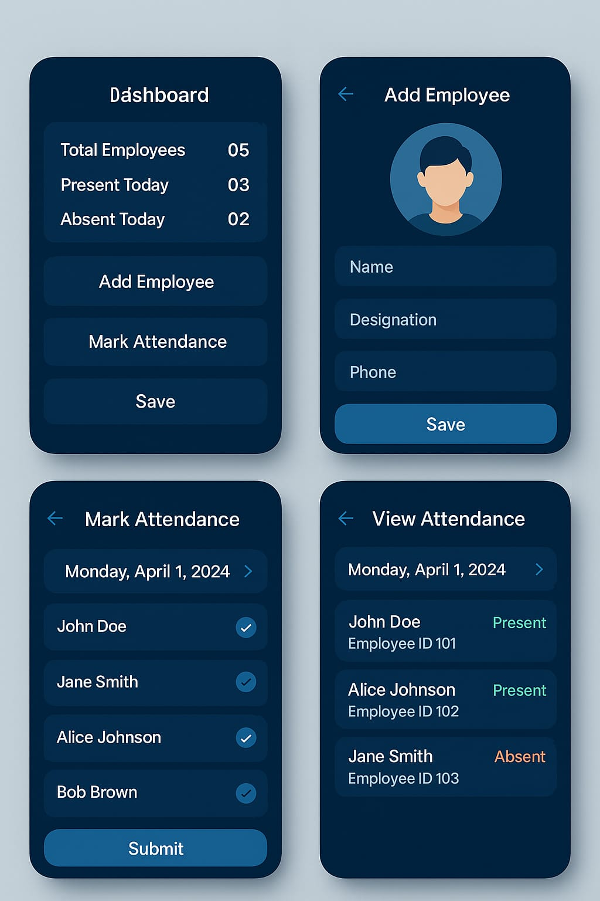

# 📋 Attendance Tracker App

An Android application to manage employee attendance efficiently. Built using **Kotlin**, **Room Database**, and **MVVM architecture**.

## ✨ Features

- 👤 Add New Employees (with profile pictures)
- 📆 Mark Daily Attendance (Present/Absent)
- 📊 Dashboard with:
  - Total Employees
  - Today’s Present & Absent Count
- 🔍 View Attendance Records
  - Filter by Date
- 📤 Export Attendance Data to CSV
- 🌗 Light/Dark Mode Support

## 🧱 Tech Stack

- **Language**: Kotlin
- **Architecture**: MVVM
- **Database**: Room
- **UI**: ViewBinding, Material Components
- **CSV Export**: FileWriter
- **Image Loading**: Glide

